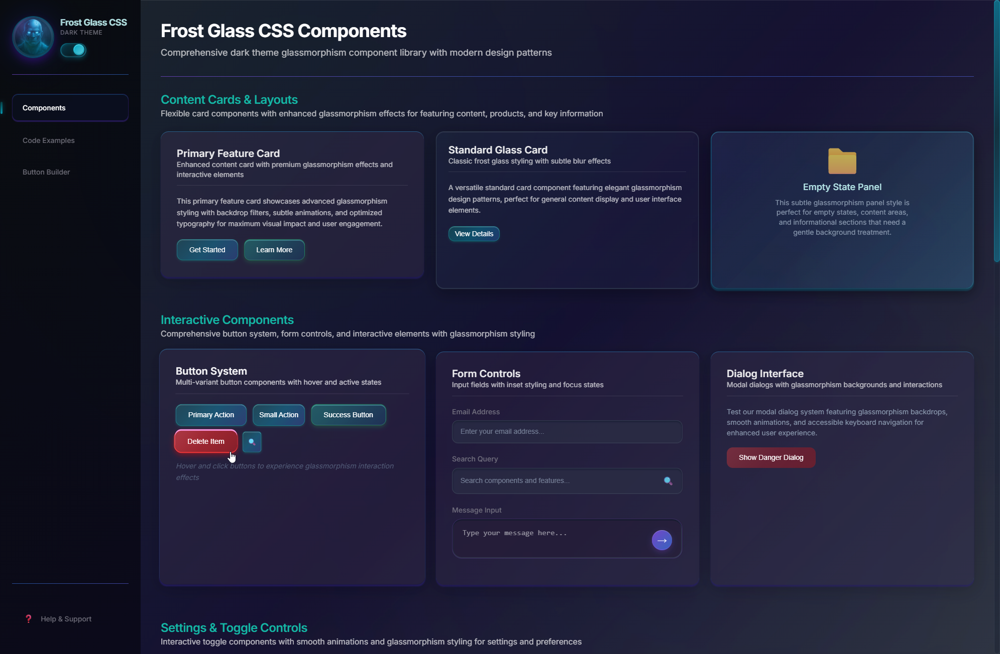
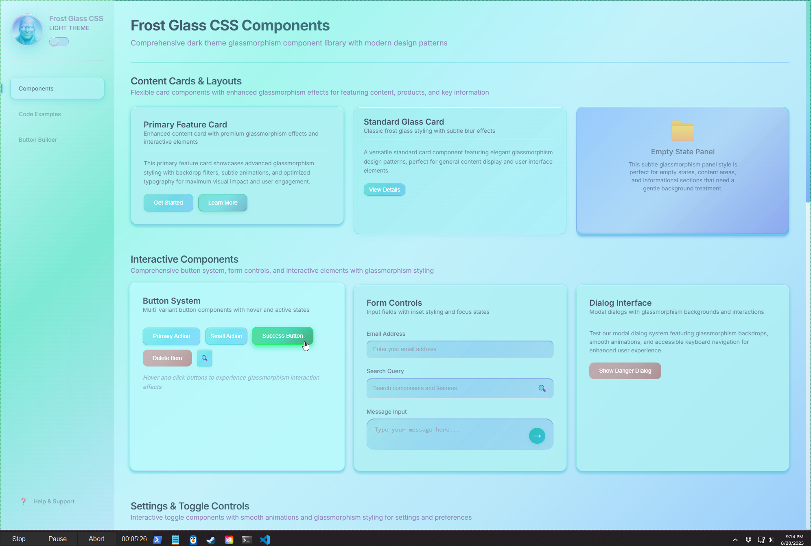
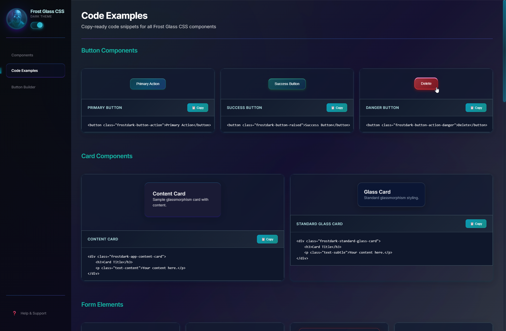

# Frost Glass CSS

Glassmorphism CSS library by Frosty40 with dark/light themes.

## Screenshots

### Dark Theme


### Light Theme


### Code Examples


## Quick Start

```html
<link rel="stylesheet" href="https://cdn.jsdelivr.net/npm/frost-glass-css@1.0.0/dist/frost-glass.min.css">

<div class="frost_dark">
    <button class="frostdark-button-action">Click me</button>
</div>
```

## Themes

**Dark Theme:** Add `frost_dark` class  
**Light Theme:** Add `frost_light` class

## Components

### Buttons
```html
<button class="frostdark-button-action">Primary</button>
<button class="frostdark-button-raised">Success</button>
<button class="frostdark-button-action-danger">Danger</button>
```

### Cards
```html
<div class="frostdark-app-content-card">
    <h3>Card Title</h3>
    <p>Content here</p>
</div>
```

### Forms
```html
<div class="frostdark-input-container">
    <input type="text" class="frostdark-input-field" placeholder="Enter text">
</div>
```

### Navigation
```html
<div class="frostdark-app-nav-item active">
    <span>🏠</span>
    <span>Dashboard</span>
</div>
```

### Empty State
```html
<div class="frostdark-empty-panel">
    <div class="empty-icon">📭</div>
    <div class="empty-text">No items found</div>
</div>
```

Replace `frostdark-` with `frostlight-` for light theme.

## How It Works

### Theme System
- **Two separate CSS systems**: `frostdark-*` and `frostlight-*` classes
- **Body class switching**: `frost_dark` or `frost_light` controls the active theme
- **Independent styling**: No shared classes between themes - complete separation

### Glassmorphism Effects
- **backdrop-filter**: Creates the frosted glass blur effect
- **Transparency layers**: Multiple rgba() backgrounds for depth
- **Box shadows**: Inset/outset shadows simulate glass lighting
- **Border gradients**: Dynamic borders that match the glass aesthetic

### CSS Architecture
```
src/
├── core/           # Variables, base styles, utilities
├── components/     # Buttons, forms, navigation
├── themes/         # frost-dark.css & frost-light.css
└── effects/        # Animations and transitions
```

### Browser Requirements
- **backdrop-filter support**: Chrome 76+, Firefox 103+, Safari 14+
- **CSS Grid**: For responsive layouts
- **CSS Custom Properties**: For theme variables

### Performance
- **No JavaScript required**: Pure CSS solution
- **Modular loading**: Import only needed components
- **Optimized selectors**: Minimal specificity conflicts

---
Created by Frosty40